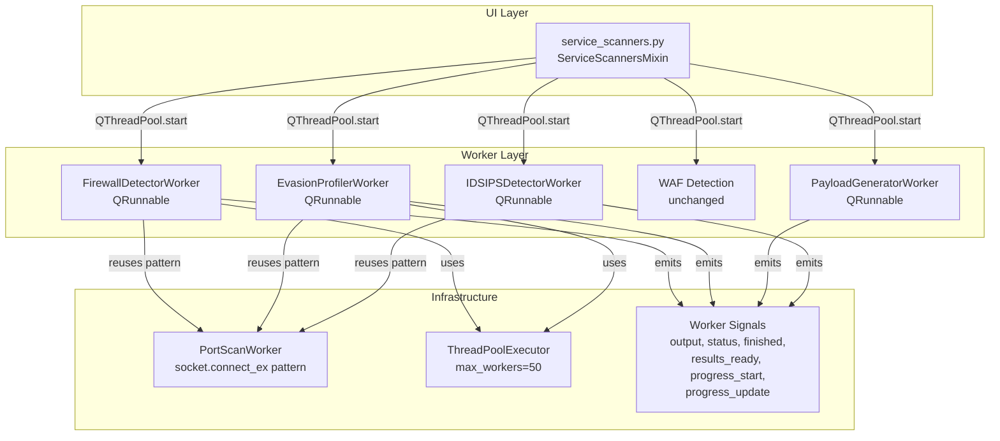

# Design Document: AV/Firewall Service Enumeration - Native Implementation

## Overview

This design replaces all external tool dependencies (nmap, msfvenom) in Huginn's AV/Firewall detection module with native Python implementations. The architecture decomposes the monolithic `AVFirewallScanner` class into four focused modules—each a QRunnable worker—while preserving the existing WAF detection unchanged and reusing the proven `PortScanWorker` socket patterns.

The key architectural decision is to leverage `socket.connect_ex()` response behavior (success, refused, timeout) as the foundation for firewall detection, rather than raw packet manipulation which requires elevated privileges. Evasion testing builds on this by varying connection parameters (source ports, timing, buffer sizes, ordering). Payload generation uses pure Python struct packing and XOR encoding to produce architecture-specific shellcode without any external binaries.

## Architecture



### Module Organization

```
app/tools/
├── av_firewall_scanner.py      # Refactored: WAF detection only (unchanged logic)
├── av_worker.py                # Refactored: dispatcher routing to new workers
├── av_firewall_utils.py        # Updated: utility functions, format helpers
├── firewall_detector.py        # NEW: Native firewall detection via TCP probes
├── evasion_profiler.py         # NEW: Native firewall evasion testing
├── payload_generator.py        # NEW: Native AV test payload generation
├── ids_ips_detector.py         # NEW: IDS/IPS behavioral detection
└── port_scanner.py             # UNCHANGED: reused socket patterns
```

### Design Decisions

1. **Separate modules per detection capability** rather than one large class — enables independent testing, clearer ownership, and parallel development.
2. **Reuse `socket.connect_ex()` pattern** from `PortScanWorker` — proven, cross-platform, no elevated privileges needed for basic detection.
3. **Raw sockets as optional enhancement** — FIN/NULL/Xmas probes attempted only when OS permissions allow, with graceful fallback.
4. **Pure Python payload generation** — `struct.pack()` for shellcode assembly, XOR for encoding. No subprocess calls, no network access.
5. **Consistent signal interface** — all workers emit the same 6 signals matching `PortScannerSignals` for uniform UI integration.

## Components and Interfaces

### FirewallDetectorWorker

```python
class FirewallDetectorSignals(QObject):
    output = pyqtSignal(str)          # HTML-formatted output
    status = pyqtSignal(str)          # Status bar text
    finished = pyqtSignal()           # Scan complete
    results_ready = pyqtSignal(dict)  # Structured results
    progress_start = pyqtSignal(int)  # Total probe count
    progress_update = pyqtSignal(int, int)  # (completed, findings)

class FirewallDetectorWorker(QRunnable):
    def __init__(self, target: str, ports: List[int], timeout: float = 3.0,
                 max_workers: int = 50):
        self.signals = FirewallDetectorSignals()
        self.target = target
        self.ports = ports
        self.timeout = timeout
        self.max_workers = max_workers
        self.is_running = True

    def run(self): ...
    def classify_port(self, port: int) -> PortState: ...
    def analyze_firewall_presence(self, results: Dict) -> FirewallResult: ...
    def perform_ack_probe(self, filtered_ports: List[int]) -> FirewallType: ...
    def analyze_timing(self, probe_results: List[ProbeResult]) -> TimingFingerprint: ...
```

**Port Classification Logic:**
- `connect_ex() == 0` → **open** (SYN-ACK equivalent)
- `connect_ex() == ECONNREFUSED (errno 10061 on Windows)` → **closed** (RST equivalent)
- `socket.timeout` or `connect_ex() == ETIMEDOUT` → **filtered** (no response)

**Firewall Presence Determination:**
- `filtered_ratio > 0.50` → "detected"
- `0.20 < filtered_ratio <= 0.50` → "likely"
- `filtered_ratio <= 0.20` → "not detected"
- All ports unreachable → "host unreachable" (distinct from firewall)

### EvasionProfilerWorker

```python
class EvasionProfilerWorker(QRunnable):
    def __init__(self, target: str, ports: List[int], timeout: float = 3.0,
                 max_workers: int = 50):
        self.signals = FirewallDetectorSignals()  # Same signal set
        self.target = target
        self.ports = ports
        self.timeout = timeout
        self.max_workers = max_workers
        self.is_running = True

    def run(self): ...
    def establish_baseline(self) -> Dict[int, PortState]: ...
    def test_source_port_evasion(self, filtered_ports: List[int]) -> TechniqueResult: ...
    def test_timing_evasion(self, filtered_ports: List[int]) -> TechniqueResult: ...
    def test_window_size_evasion(self, filtered_ports: List[int]) -> TechniqueResult: ...
    def test_pattern_evasion(self, filtered_ports: List[int]) -> TechniqueResult: ...
    def test_flag_manipulation(self, filtered_ports: List[int]) -> TechniqueResult: ...
```

**Evasion Techniques:**
| Technique | Method | Parameters |
|-----------|--------|------------|
| Source Port | Bind to known-allowed ports before connect | 53, 80, 443, 88 + 4 random |
| Timing | Vary inter-probe delay | 0ms, 1000ms, 5000ms, 15000ms |
| Window Size | Set SO_SNDBUF before connect | 1024, 4096, 16384, 65535 |
| Pattern | Vary port ordering | Sequential vs randomized |
| Flag Manipulation | Raw sockets (if permitted) | FIN, NULL, Xmas |

**Success Threshold:** A technique is "successful" if a previously-filtered port responds on ≥ 2 of 3 attempts.

### PayloadGeneratorWorker

```python
class PayloadGeneratorWorker(QRunnable):
    def __init__(self, payload_type: str = "reverse_tcp",
                 payload_format: str = "raw", architecture: str = "x64",
                 encoding: str = "xor", lhost: str = "", lport: int = 4444,
                 staged: bool = False):
        self.signals = FirewallDetectorSignals()  # Same signal set
        self.is_running = True
        # ... params

    def run(self): ...
    def generate_shellcode(self) -> bytes: ...
    def apply_encoding(self, shellcode: bytes) -> Tuple[bytes, bytes]: ...
    def format_output(self, encoded: bytes) -> Union[bytes, str]: ...
    def calculate_detection_score(self, payload: bytes, encoding_layers: int) -> int: ...
    def generate_staged(self) -> Tuple[bytes, bytes]: ...
```

**Supported Payload Types:**
- `reverse_tcp` — Connect-back shell using WSASocket + connect
- `bind_tcp` — Listen shell using WSASocket + bind + listen + accept
- `cmd_exec` — Command execution using WinExec/CreateProcess

**Supported Formats:**
- `raw` — Raw shellcode bytes
- `exe` — Minimal PE with shellcode in .text section
- `dll` — PE DLL with shellcode in DllMain
- `powershell` — Base64-encoded shellcode in PowerShell execution cradle

**Encoding Options:**
- XOR with random key (1–32 bytes) + decoder stub prepended
- Base64 wrapping
- Custom byte substitution table

### IDSIPSDetectorWorker

```python
class IDSIPSDetectorWorker(QRunnable):
    def __init__(self, target: str, ports: List[int], timeout: float = 3.0):
        self.signals = FirewallDetectorSignals()
        self.target = target
        self.ports = ports
        self.timeout = timeout
        self.is_running = True

    def run(self): ...
    def establish_baseline(self, port: int) -> BaselineResult: ...
    def send_attack_signatures(self, port: int) -> AttackResult: ...
    def detect_rate_limiting(self, port: int) -> RateLimitResult: ...
    def analyze_behavioral_indicators(self) -> IDSResult: ...
```

**Detection Methods:**
1. **Signature-based**: Benign requests → attack patterns (SQLi, XSS, path traversal). IDS inferred if 2+ consecutive attack requests get reset/timeout.
2. **Timing-based**: IPS flagged if attack request avg response time > 200% of baseline avg.
3. **Rate-limiting**: Connections at 1, 5, 10, 20, 50/sec. Threshold = rate where rejection begins.

**Confidence Mapping:**
- 1 indicator → low
- 2 indicators → medium
- 3+ indicators → high

## Data Models

### PortState Enum

```python
from enum import Enum

class PortState(Enum):
    OPEN = "open"
    CLOSED = "closed"
    FILTERED = "filtered"
```

### ProbeResult

```python
@dataclass
class ProbeResult:
    port: int
    state: PortState
    response_time_ms: int      # Whole milliseconds
    ttl: Optional[int] = None  # If available from platform
    error_code: Optional[int] = None
```

### FirewallResult

```python
@dataclass
class FirewallResult:
    target: str
    firewall_status: str       # "detected", "likely", "not detected", "host unreachable"
    firewall_type: Optional[str]  # "stateful", "packet-filter", None
    confidence_score: int      # 0-100
    filtered_ports: List[int]
    open_ports: List[int]
    closed_ports: List[int]
    filtered_ratio: float
    timing_fingerprint: Optional[TimingFingerprint]
```

### TimingFingerprint

```python
@dataclass
class TimingFingerprint:
    inferred_device_type: str
    confidence: float          # 0.0 to 1.0
    mean_open_ms: float
    mean_closed_ms: float
    mean_filtered_ms: float
    stddev_open_ms: float
    stddev_closed_ms: float
    stddev_filtered_ms: float
    ttl_hop_counts: Optional[Dict[str, int]]  # {"open": N, "filtered": M}
    ports_sampled: Dict[str, int]  # {"open": X, "closed": Y, "filtered": Z}
```

### TechniqueResult

```python
@dataclass
class TechniqueResult:
    technique_name: str
    classification: str        # "successful", "failed", "skipped"
    ports_accessible: List[int]
    evidence: List[Dict[str, Any]]  # Per-port evidence entries
    error: Optional[str] = None
```

### EvasionSummary

```python
@dataclass
class EvasionSummary:
    target: str
    baseline_filtered_ports: List[int]
    techniques: List[TechniqueResult]
    successful_count: int
    failed_count: int
    skipped_count: int
```

### PayloadConfig

```python
@dataclass
class PayloadConfig:
    payload_type: str          # "reverse_tcp", "bind_tcp", "cmd_exec"
    payload_format: str        # "raw", "exe", "dll", "powershell"
    architecture: str          # "x86", "x64"
    encoding: str              # "xor", "base64", "substitution"
    xor_key_length: int        # 1-32
    lhost: str
    lport: int
    staged: bool
```

### PayloadResult

```python
@dataclass
class PayloadResult:
    payload_bytes: bytes
    stager_bytes: Optional[bytes]  # If staged
    format_used: str
    architecture: str
    encoding_layers: int
    detection_score: int       # 0-100
    size_bytes: int
```

### IDSResult

```python
@dataclass
class IDSResult:
    detected: bool
    detection_method: str      # "signature", "timing", "rate_limiting"
    confidence: str            # "low", "medium", "high"
    indicators: List[Dict[str, Any]]
    affected_ports: List[int]
    triggering_signatures: List[str]
    baseline_avg_ms: float
    attack_avg_ms: float
    rate_limit_threshold: Optional[int]  # connections/sec
```

### ScanResult (Unified Output)

```python
@dataclass
class ScanResult:
    target: str
    scan_type: str
    detected_security_products: List[Dict[str, str]]  # [{type, name}]
    filtered_ports: List[str]
    successful_evasion_techniques: List[str]
    confidence_scores: Dict[str, int]  # {finding_name: 0-100}
    recommended_next_steps: List[str]
    error: Optional[str]
```

## Correctness Properties

*A property is a characteristic or behavior that should hold true across all valid executions of a system—essentially, a formal statement about what the system should do. Properties serve as the bridge between human-readable specifications and machine-verifiable correctness guarantees.*

### Property 1: Port State Classification

*For any* port number and socket response (success code 0, connection-refused error, or timeout), the classification function SHALL map success to "open", connection-refused to "closed", and timeout to "filtered", regardless of the configured timeout value within the valid range of 1–30 seconds.

**Validates: Requirements 1.1, 1.2, 1.3, 1.4**

### Property 2: Firewall Presence Ratio Classification

*For any* pair of (filtered_port_count, total_port_count) where total > 0, the firewall presence function SHALL return "detected" when filtered/total > 0.50, "likely" when 0.20 < filtered/total ≤ 0.50, and "not detected" when filtered/total ≤ 0.20.

**Validates: Requirements 1.5**

### Property 3: Host Unreachable vs Firewall Distinction

*For any* port list where all ports return timeout or network-unreachable errors (no open or closed ports exist), the analysis function SHALL report "host unreachable" and SHALL NOT report firewall presence as "detected" or "likely".

**Validates: Requirements 1.9**

### Property 4: Timing Statistics and Active Filtering Inference

*For any* collection of probe results with at least 5 entries per port-state category, the timing analysis function SHALL compute mean and standard deviation correctly, and SHALL infer "active filtering" if and only if |mean_filtered - mean_closed| exceeds the configured threshold.

**Validates: Requirements 2.3, 2.4**

### Property 5: TTL Hop Count Estimation

*For any* observed TTL value, the hop count estimator SHALL compute the correct hop count by subtracting from the nearest standard OS default (64, 128, 255), and SHALL flag an intermediate filtering device when the hop count difference between filtered ports and open ports is ≥ 2.

**Validates: Requirements 2.5**

### Property 6: Evasion Technique Success Classification

*For any* set of connection attempt results for a single technique against a single port, the technique SHALL be classified as "successful" if and only if at least 2 out of 3 attempts result in a successful TCP connection to a port that was classified as "filtered" during the baseline scan.

**Validates: Requirements 3.2, 3.4, 3.7**

### Property 7: Evasion Summary Completeness

*For any* completed evasion test, the summary SHALL contain an entry for every technique tested with its classification (successful, failed, or skipped), the count of ports that became accessible, and the specific port numbers that changed state from filtered to accessible.

**Validates: Requirements 3.8**

### Property 8: Payload Format Conformance

*For any* valid payload configuration (supported type × supported format × supported architecture), the generator SHALL produce non-empty output where: exe/dll output begins with the PE magic bytes (MZ/0x4D5A), powershell output is a syntactically valid PowerShell script containing base64-encoded content, and raw output is non-empty bytes.

**Validates: Requirements 4.1, 4.2**

### Property 9: Encoding Round-Trip

*For any* generated shellcode and any supported encoding configuration (XOR with key length 1–32, base64, substitution), applying the encoding followed by the corresponding decoding function SHALL produce bytes identical to the original shellcode.

**Validates: Requirements 4.4**

### Property 10: Detection Score Calculation

*For any* payload with a known number of encoding layers (≥ 0) and a known signature match percentage (0–100%), the detection score SHALL be an integer in the range 0–100 that decreases monotonically as encoding layers increase (with signature percentage held constant).

**Validates: Requirements 4.5**

### Property 11: Staged Payload Component Separation

*For any* staged payload request, the generator SHALL produce exactly two components (stager and main payload), and the concatenation of the stager alone SHALL NOT contain the full execution shellcode—i.e., neither component in isolation is functionally complete.

**Validates: Requirements 4.6**

### Property 12: Input Validation and Rejection

*For any* input where the port number is outside 1–65535, or the timeout is outside 1–30, or the thread count is outside 1–200, or the payload format is not in {exe, dll, raw, powershell}, or the payload type is not in {reverse_tcp, bind_tcp, cmd_exec}, the system SHALL reject the request with an error message identifying the specific invalid parameter.

**Validates: Requirements 4.10, 7.6**

### Property 13: HTML Output Formatting

*For any* output message emitted by a worker, the string SHALL be a valid HTML paragraph element (`<p>`) with an inline `style` attribute containing a `color` property set to one of the defined color codes (#00FF41, #FF6B6B, #00BFFF, #FFAA00) based on message severity.

**Validates: Requirements 5.7, 8.2**

### Property 14: IDS/IPS Behavioral Inference

*For any* port where baseline requests all succeed and attack-signature requests result in 2 or more consecutive connection resets or timeouts, the IDS/IPS detector SHALL infer IDS/IPS presence. Additionally, *for any* port where attack request average response time exceeds 200% of baseline average, inline IPS SHALL be flagged.

**Validates: Requirements 6.2, 6.3**

### Property 15: IDS Confidence Level Mapping

*For any* IDS/IPS detection result with N behavioral indicators, the confidence level SHALL be "low" when N = 1, "medium" when N = 2, and "high" when N ≥ 3.

**Validates: Requirements 6.5**

### Property 16: Rate Limiting Threshold Detection

*For any* sequence of connection rates where a previously-accessible port transitions from accepting to rejecting connections at rate R, the rate-limit detector SHALL report R as the detected threshold.

**Validates: Requirements 6.4**

### Property 17: Port List Parsing

*For any* valid port specification string containing comma-separated integers and/or hyphenated ranges (e.g., "80,443,8000-8100"), the parser SHALL produce a list containing exactly the specified port numbers, all within range 1–65535, with no duplicates, and with total count not exceeding 10000.

**Validates: Requirements 7.4**

### Property 18: Result Structure Validation

*For any* completed or partially-completed scan, the emitted result dictionary SHALL contain all required keys (target, scan_type, detected_security_products, filtered_ports, successful_evasion_techniques, confidence_scores, error) with correct types, and when filtered_ports is non-empty, SHALL additionally contain a recommended_next_steps list.

**Validates: Requirements 1.6, 2.7, 7.3, 8.1, 8.3, 8.5**

## Error Handling

### Network Errors

| Error Condition | Handling |
|----------------|----------|
| Target unreachable (all ports timeout) | Report "host unreachable", do not infer firewall |
| DNS resolution failure | Emit error via output signal, emit finished, abort scan |
| Socket creation failure | Log error, skip affected port, continue with remaining |
| Permission denied (raw sockets) | Fall back to connect-scan, report limitation |
| ThreadPoolExecutor exhaustion | Queue excess work, process when threads free |

### Input Validation Errors

| Condition | Response |
|-----------|----------|
| Empty/None target | Emit HTML error message, emit finished signal |
| Port outside 1–65535 | Reject with parameter-specific error message |
| Timeout outside 1–30 | Reject with parameter-specific error message |
| Unsupported payload format | Reject listing supported formats |
| Unsupported payload type | Reject listing supported types |

### Cancellation Handling

All workers check `self.is_running` at these points:
1. Before each port probe submission to ThreadPoolExecutor
2. Before each evasion technique iteration
3. Before payload encoding steps
4. Inside ThreadPoolExecutor futures loop (via `as_completed`)

On cancellation (`is_running = False`):
- Pending futures are not awaited
- Partial results collected so far are emitted via `results_ready`
- `finished` signal emitted within 2–3 seconds

### Payload Generation Errors

- Architecture mismatch: reject with clear error
- Encoding failure: fall back to raw (no encoding), report in output
- PE construction failure: report error, offer raw format as alternative

## Testing Strategy

### Property-Based Testing

Property-based testing is appropriate for this feature because the core logic involves pure classification functions, mathematical computations, and format validation—all of which have clear input/output behavior that varies meaningfully across a wide input space.

**Library:** [Hypothesis](https://hypothesis.readthedocs.io/) for Python

**Configuration:**
- Minimum 100 iterations per property test
- Each test tagged with: `Feature: av-fw-service-enumeration, Property {N}: {title}`

**Properties to implement as PBT:**
- Properties 1–18 as defined in the Correctness Properties section
- Generators for: port numbers (1–65535), timeout values (1–30), port state combinations, response times, TTL values, payload configurations, encoding keys, port specification strings

### Unit Tests (Example-Based)

| Area | Test Cases |
|------|-----------|
| ACK probe triggering | Verify probe runs when ≥1 filtered port; skipped when 0 |
| TTL unavailability | Mock platform without TTL support, verify graceful skip |
| Raw socket denial | Mock permission error, verify fallback to connect-scan |
| Privileged port bind failure | Mock EACCES, verify skip and continue |
| Payload type examples | One test per type (reverse_tcp, bind_tcp, cmd_exec) |
| Architecture defaults | No arch specified → x64 output |
| IDS no open ports | Verify abort with appropriate message |
| Configuration acceptance | Valid parameter combinations accepted |

### Integration Tests

| Area | Test Cases |
|------|-----------|
| Cancellation timing | Start scan, cancel, verify stop within 3 seconds |
| Progress emission | Run scan, verify progress signals every 10 probes |
| Signal flow | Verify output → status → results_ready → finished order |
| Full scan workflow | End-to-end with mock network layer |
| Worker lifecycle | QThreadPool start → run → finished signal chain |

### Test Organization

```
tests/
├── test_firewall_detector.py       # Unit + property tests for classification
├── test_evasion_profiler.py        # Unit + property tests for evasion logic
├── test_payload_generator.py       # Unit + property tests for payload gen
├── test_ids_ips_detector.py        # Unit + property tests for IDS detection
├── test_port_list_parser.py        # Property tests for parsing
├── test_scan_results.py            # Property tests for result structure
└── test_integration_av_fw.py       # Integration tests for worker lifecycle
```

### Mocking Strategy

- **Socket layer**: Mock `socket.connect_ex()` return values and timing with `unittest.mock.patch`
- **Raw sockets**: Mock `socket.socket(AF_INET, SOCK_RAW)` to simulate permission denied
- **ThreadPoolExecutor**: Use real executor with mocked socket calls (fast execution)
- **HTTP requests (IDS)**: Mock `socket.send/recv` for attack-signature response simulation
- **Time measurement**: Use `unittest.mock.patch('time.perf_counter')` for deterministic timing tests
