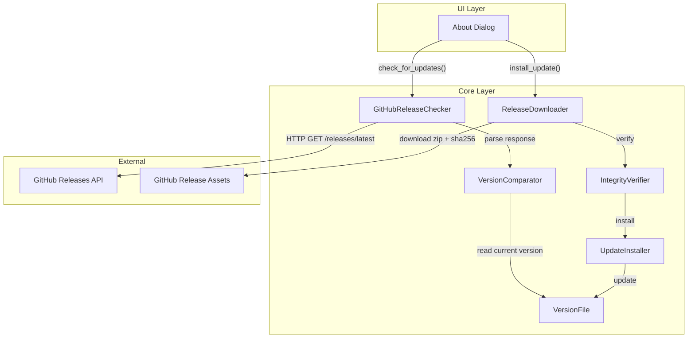

# Design Document: Update System Overhaul

## Overview

This design replaces Huginn's existing S3/CloudFront-based update system with a GitHub Releases-based approach. The new system is manual-only — updates are checked and installed exclusively when the user clicks "Check for Updates" in the About dialog. There are no background threads, timers, or auto-check mechanisms.

The overhaul addresses three core problems:
1. **Version inconsistency** — three different version strings exist across the codebase (auto_updater.py: 1.3.1, manifest.json: 1.3.3, setup.py: 8.0.0). A single `VERSION` file becomes the canonical source of truth.
2. **Dead infrastructure** — the S3/CloudFront updater requires AWS credentials that aren't reliably available, and the `TempSecureUpdater` workaround confirms the system is broken.
3. **Unwanted background activity** — the current `UpdateManager` spawns daemon threads for periodic checks. The new system only acts on explicit user request.

### Key Design Decisions

| Decision | Rationale |
|----------|-----------|
| GitHub Releases API (public, unauthenticated) | No AWS credentials needed; aligns with source hosting |
| SHA256 checksum file (no RSA signatures) | Simpler integrity verification; GitHub's TLS provides transport security |
| Single `VERSION` file at project root | Eliminates multi-source version drift; trivially readable by scripts and CI |
| Manual-only "Check for Updates" | User stays in control; no surprise network traffic or background threads |
| In-place extraction with backup/rollback | Same approach as current system but with proper failure recovery |

## Architecture



### Data Flow

1. **Check for Updates**: User clicks button → `GitHubReleaseChecker` queries GitHub API → `VersionComparator` compares remote vs. local (from `VERSION` file) → result displayed in About Dialog
2. **Install Update**: User clicks "Install Update" → `ReleaseDownloader` fetches zip + checksum → `IntegrityVerifier` validates SHA256 → `UpdateInstaller` backs up `app/`, extracts zip, updates `VERSION` → success/failure shown in dialog
3. **Rollback**: If extraction or VERSION update fails → `UpdateInstaller` restores `app/` from backup and reverts `VERSION` file

## Components and Interfaces

### 1. `app/core/version.py` — Version Management

Provides version reading, parsing, and comparison utilities.

```python
class VersionError(Exception):
    """Raised when VERSION file is missing or malformed."""
    pass

def get_version() -> str:
    """Read and validate the version from the VERSION file.
    
    Returns:
        The version string (e.g., "8.0.0")
    
    Raises:
        VersionError: If VERSION file is missing or doesn't match MAJOR.MINOR.PATCH
    """

def parse_version(version_str: str) -> tuple[int, int, int]:
    """Parse a semantic version string into (major, minor, patch).
    
    Strips leading 'v' prefix if present.
    
    Raises:
        ValueError: If string doesn't match semantic version format
    """

def compare_versions(current: str, remote: str) -> int:
    """Compare two version strings.
    
    Returns:
        -1 if current < remote (update available)
         0 if current == remote
         1 if current > remote
    """
```

### 2. `app/core/github_updater.py` — GitHub Release Checker & Downloader

Single module handling all GitHub Releases interaction.

```python
from dataclasses import dataclass
from typing import Optional, Callable

@dataclass
class ReleaseInfo:
    """Parsed GitHub release information."""
    version: str              # Semantic version (no 'v' prefix)
    zip_url: str              # Download URL for the zip archive
    checksum_url: str         # Download URL for the .sha256 file
    release_notes: str        # Release body/description

class UpdateCheckError(Exception):
    """Base error for update check failures."""
    pass

class NetworkError(UpdateCheckError):
    pass

class TimeoutError(UpdateCheckError):
    pass

class AssetNotFoundError(UpdateCheckError):
    pass

class VersionFormatError(UpdateCheckError):
    pass

class GitHubReleaseChecker:
    """Queries GitHub Releases API for the latest release."""
    
    GITHUB_API_URL = "https://api.github.com/repos/{owner}/{repo}/releases/latest"
    REQUEST_TIMEOUT = 30  # seconds
    
    def __init__(self, owner: str, repo: str):
        self.owner = owner
        self.repo = repo
    
    def check_for_update(self) -> Optional[ReleaseInfo]:
        """Check GitHub for a newer release than the current version.
        
        Returns:
            ReleaseInfo if an update is available, None otherwise.
            
        Raises:
            NetworkError: Connection failed
            TimeoutError: Request exceeded 30s
            AssetNotFoundError: Release missing zip or checksum
            VersionFormatError: Tag not valid semver
        """


class ReleaseDownloader:
    """Downloads release assets with progress reporting."""
    
    DOWNLOAD_TIMEOUT = 300  # seconds
    
    def download(
        self,
        url: str,
        destination: Path,
        progress_callback: Optional[Callable[[int, int], None]] = None
    ) -> Path:
        """Download a file with progress reporting.
        
        Args:
            url: The download URL
            destination: Local file path to save to
            progress_callback: Called with (bytes_received, total_bytes)
            
        Raises:
            NetworkError: Download failed
            TimeoutError: Download exceeded 300s
        """
```

### 3. `app/core/integrity_verifier.py` — SHA256 Verification

```python
class IntegrityError(Exception):
    """Hash mismatch or checksum file parse error."""
    pass

class ChecksumFormatError(IntegrityError):
    """Checksum file doesn't contain a valid SHA256 hex string."""
    pass

class IntegrityVerifier:
    """Verifies downloaded files against SHA256 checksums."""
    
    def verify(self, archive_path: Path, checksum_path: Path) -> bool:
        """Verify archive integrity against checksum file.
        
        Checksum file format: <64-char-hex>  <filename>
        
        Raises:
            ChecksumFormatError: Can't extract valid SHA256 from checksum file
            IntegrityError: Hash mismatch
        """
```

### 4. `app/core/update_installer.py` — Installation with Backup & Rollback

```python
class InstallationError(Exception):
    pass

class RollbackError(Exception):
    """Rollback itself failed — includes backup path for manual recovery."""
    def __init__(self, message: str, backup_path: Path):
        super().__init__(message)
        self.backup_path = backup_path

class UpdateInstaller:
    """Handles safe update installation with backup and rollback."""
    
    def __init__(self, app_root: Path):
        self.app_root = app_root
        self.backup_dir = app_root / "backup"
    
    def install(self, archive_path: Path, new_version: str) -> None:
        """Install update with backup/rollback.
        
        Steps:
            1. Create backup of app/ directory
            2. Extract archive over app/
            3. Update VERSION file
            4. Delete backup
            
        On failure after step 1:
            - Restore app/ from backup
            - Restore VERSION file
            
        Raises:
            InstallationError: Install failed but rollback succeeded
            RollbackError: Rollback itself failed (includes backup_path)
        """
```

### 5. `app/widgets/about_dialog.py` — Updated UI

The About dialog retains its existing structure but replaces the S3-based worker threads with the new GitHub-based system.

```python
class UpdateCheckWorker(QThread):
    """Background thread for checking GitHub releases."""
    update_available = pyqtSignal(object)  # ReleaseInfo
    no_update = pyqtSignal()
    error = pyqtSignal(str)

class UpdateInstallWorker(QThread):
    """Background thread for downloading and installing updates."""
    progress = pyqtSignal(int, int)        # bytes_received, total_bytes
    status = pyqtSignal(str)               # status message
    finished = pyqtSignal(bool, str)       # success, message
```

### 6. `release_packager.py` — Updated Release Packager

Replaces RSA signing with SHA256 checksum file generation. Reads version from `VERSION` file. Outputs to `dist/` directory.

```python
class ReleasePackager:
    """Creates release artifacts for GitHub Releases."""
    
    def __init__(self):
        self.app_root = Path(__file__).parent
        self.version = self._read_version()
        self.dist_dir = self.app_root / "dist"
    
    def create_release(self) -> tuple[Path, Path]:
        """Create zip archive and SHA256 checksum file.
        
        Returns:
            Tuple of (zip_path, checksum_path) in dist/ directory
            
        Output files:
            dist/huginn-{version}.zip
            dist/huginn-{version}.zip.sha256
        """
```

## Data Models

### VERSION File

- **Location**: `{project_root}/VERSION`
- **Format**: Single line, UTF-8, no BOM, no trailing newline or whitespace
- **Content**: `MAJOR.MINOR.PATCH` (e.g., `8.0.0`)
- **Validation regex**: `^\d+\.\d+\.\d+$`

### GitHub Releases API Response (relevant fields)

```json
{
  "tag_name": "v8.1.0",
  "name": "Huginn v8.1.0",
  "body": "Release notes markdown...",
  "assets": [
    {
      "name": "huginn-8.1.0.zip",
      "browser_download_url": "https://github.com/owner/repo/releases/download/v8.1.0/huginn-8.1.0.zip"
    },
    {
      "name": "huginn-8.1.0.zip.sha256",
      "browser_download_url": "https://github.com/owner/repo/releases/download/v8.1.0/huginn-8.1.0.zip.sha256"
    }
  ]
}
```

### Checksum File Format

```
<64-hex-chars>  huginn-8.1.0.zip
```

Standard `sha256sum` output format — hex digest, two spaces, filename.

### ReleaseInfo Dataclass

| Field | Type | Description |
|-------|------|-------------|
| `version` | `str` | Semantic version without 'v' prefix |
| `zip_url` | `str` | Full download URL for the zip |
| `checksum_url` | `str` | Full download URL for the .sha256 |
| `release_notes` | `str` | GitHub release body text |


## Correctness Properties

*A property is a characteristic or behavior that should hold true across all valid executions of a system — essentially, a formal statement about what the system should do. Properties serve as the bridge between human-readable specifications and machine-verifiable correctness guarantees.*

### Property 1: Version Validation

*For any* string, the version parser SHALL accept it if and only if it matches the regex `^\d+\.\d+\.\d+$` (after stripping a single leading "v" if present). All other strings SHALL be rejected with a `VersionError` or `ValueError`.

**Validates: Requirements 1.1, 1.5, 11.6**

### Property 2: Version Prefix Stripping Idempotence

*For any* valid semantic version string optionally prefixed with "v" (e.g., "v1.2.3" or "1.2.3"), parsing SHALL produce the same (major, minor, patch) tuple regardless of whether the "v" prefix is present.

**Validates: Requirements 2.2, 3.1**

### Property 3: Numeric Version Comparison

*For any* two valid semantic version strings A and B, `compare_versions(A, B)` SHALL return a result consistent with comparing their (major, minor, patch) tuples as integers in lexicographic order — i.e., `compare_versions(A, B) < 0` if and only if `(A.major, A.minor, A.patch) < (B.major, B.minor, B.patch)`.

**Validates: Requirements 3.2, 3.3, 3.4**

### Property 4: HTTP Error Code Preservation

*For any* HTTP error status code (4xx or 5xx) returned by the GitHub API, the resulting error message SHALL contain that status code as a substring.

**Validates: Requirements 2.4**

### Property 5: Integrity Verification Round-Trip

*For any* byte sequence written to a file, computing the SHA256 hash via `IntegrityVerifier` and comparing it (case-insensitively) against the hex digest produced by `hashlib.sha256` over the same bytes SHALL always report a match.

**Validates: Requirements 5.1, 5.2**

### Property 6: Checksum Format Validation

*For any* string that does not contain exactly 64 hexadecimal characters followed by two spaces and a filename, the checksum parser SHALL raise a `ChecksumFormatError`.

**Validates: Requirements 5.4**

### Property 7: Rollback Invariant

*For any* initial app directory state and VERSION file content, if the installation process fails at any point after backup creation, then after rollback completes the app directory contents and VERSION file SHALL be byte-for-byte identical to their pre-update state.

**Validates: Requirements 7.1, 7.2**

### Property 8: Release Packaging Correctness

*For any* valid semantic version in the VERSION file and any app directory contents, running the release packager SHALL produce:
- A zip file named `huginn-{version}.zip` in `dist/`
- A checksum file named `huginn-{version}.zip.sha256` in `dist/` whose content is the SHA256 hex digest of the zip followed by two spaces and the zip filename

And the checksum in the file SHALL match an independently computed SHA256 of the zip archive.

**Validates: Requirements 11.1, 11.2**

## Error Handling

### Error Hierarchy

```
UpdateSystemError (base)
├── VersionError                 — VERSION file missing or malformed
├── UpdateCheckError             — Failures during GitHub API check
│   ├── NetworkError             — Connection refused / unreachable
│   ├── TimeoutError             — 30s request timeout exceeded
│   ├── AssetNotFoundError       — Release missing expected assets
│   └── VersionFormatError       — Tag not parseable as semver
├── DownloadError                — Failures during asset download
│   ├── NetworkError             — Connection lost mid-download
│   ├── TimeoutError             — 300s download timeout exceeded
│   └── HttpError                — Non-2xx response (includes status code)
├── IntegrityError               — Hash verification failures
│   └── ChecksumFormatError      — Checksum file malformed
├── InstallationError            — Extraction or file operation failures
└── RollbackError                — Rollback itself failed (includes backup_path)
```

### Error Propagation Strategy

1. **Core modules** raise specific exceptions with descriptive messages
2. **Worker threads** catch all exceptions and emit them via Qt signals (`error` signal carries the message string)
3. **About Dialog** receives error strings and displays them in the update log `QTextEdit`
4. **No silent failures** — every error is surfaced to the user with actionable information

### Cleanup on Error

| Failure Point | Cleanup Action |
|---------------|----------------|
| GitHub API request fails | No cleanup needed (nothing downloaded) |
| Download fails mid-stream | Delete partial files |
| Integrity check fails | Delete downloaded zip and checksum |
| Backup creation fails | Abort (nothing to restore) |
| Extraction fails | Rollback from backup |
| VERSION update fails | Rollback from backup (including VERSION) |
| Rollback fails | Display backup path for manual recovery |

### Critical Design Rules

- **Never leave partial state**: If any step fails, the system must either succeed entirely or return to the pre-update state
- **Backup before mutation**: The backup MUST be created and verified before any modification to `app/` or `VERSION`
- **Timeout all network operations**: 30s for API calls, 300s for downloads — prevents indefinite hangs
- **Clean up temp files**: Downloaded archives are deleted after successful installation or after any failure

## Testing Strategy

### Unit Tests (pytest)

Unit tests cover specific examples, edge cases, and error conditions:

| Module | Test Focus |
|--------|------------|
| `version.py` | Valid/invalid version strings, file read errors, edge formats |
| `github_updater.py` | Mock API responses (success, errors, missing assets, malformed tags) |
| `integrity_verifier.py` | Known hash match/mismatch, malformed checksum files |
| `update_installer.py` | Backup creation, extraction, rollback with mock filesystem |
| `release_packager.py` | Output file naming, checksum content, missing VERSION |
| `about_dialog.py` | UI state transitions, button enable/disable, signal handling |

### Property-Based Tests (Hypothesis)

Property-based tests validate universal correctness guarantees using the [Hypothesis](https://hypothesis.readthedocs.io/) library. Each test runs a minimum of 100 iterations with randomly generated inputs.

| Property | Module Under Test | Generator Strategy |
|----------|-------------------|-------------------|
| Property 1: Version Validation | `version.py` | Random strings (text, partial versions, valid semver, whitespace variations) |
| Property 2: Prefix Stripping | `version.py` | Valid semver with/without "v" prefix |
| Property 3: Numeric Comparison | `version.py` | Pairs of random (int, int, int) tuples formatted as version strings |
| Property 4: HTTP Error Preservation | `github_updater.py` | Random integers in range 400–599 |
| Property 5: Integrity Round-Trip | `integrity_verifier.py` | Random byte sequences (1B to 10MB) |
| Property 6: Checksum Format | `integrity_verifier.py` | Random strings not matching sha256sum format |
| Property 7: Rollback Invariant | `update_installer.py` | Random directory trees with random file contents, failure at random step |
| Property 8: Packaging Correctness | `release_packager.py` | Random valid versions, random file contents in app directory |

**Configuration:**
- Library: `hypothesis` (Python)
- Minimum iterations: 100 per property (`@settings(max_examples=100)`)
- Each test tagged with: `# Feature: update-system-overhaul, Property {N}: {description}`

### Integration Tests

Integration tests verify end-to-end workflows with mocked external services:

1. **Full update flow** (check → download → verify → install → restart prompt)
2. **Full rollback flow** (check → download → verify → install fails → rollback → original state)
3. **Network failure recovery** (various failure points produce correct error messages)
4. **Release packaging** (run packager, verify artifacts are GitHub-uploadable)

### Smoke Tests

Static checks that verify legacy code removal:

- `auto_updater.py` does not exist
- `temp_update_fix.py` does not exist
- `deploy_update.sh` does not exist
- No CloudFront/S3 URLs in update-related modules
- No background threading for updates in any module
- `main.py` has no `_cleanup_update_manager` reference
