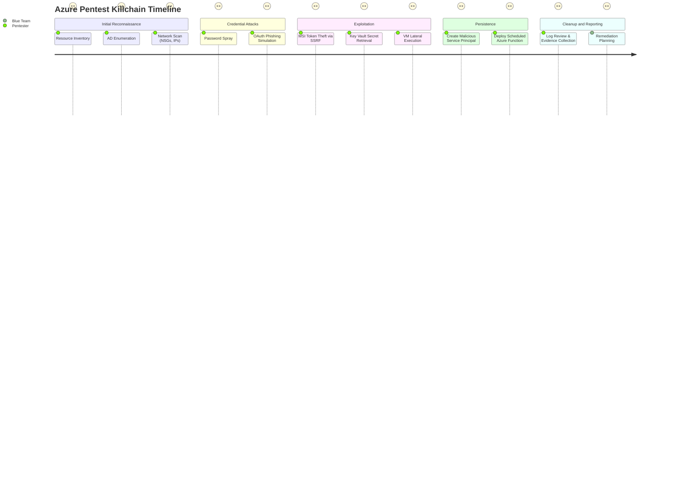

# Azure Penetration Testing Implementation Plan

**Executive Summary:** This plan outlines a comprehensive approach for conducting penetration testing on Azure environments. It covers discovery of all Azure resources (infrastructure, services, identities), mapping network topology, and identifying misconfigurations. It then describes advanced attack simulations (token/credential theft, privilege escalation, lateral movement, persistence) using modern tools and techniques. Each phase includes objectives, safe commands (CLI/PowerShell/Graph), expected outputs, logging/detection hints, risk assessment, and mitigation guidance. We also define required permissions (and fallback for limited accounts) and provide detection queries (KQL) for Azure Monitor/Sentinel. The plan assumes a single Azure tenant with unspecified size and region (adjust scale accordingly). 

## Inventory of Azure Resources (Infrastructure Enumeration)  
**Objective:** Catalog all Azure resources (compute, storage, databases, PaaS, etc.) and metadata to understand the attack surface.  

- **Commands/Tools:** Use Azure CLI and Resource Graph. For example, `az account list`/`show` to confirm subscription context. Use [Azure Resource Graph](https://learn.microsoft.com/azure/governance/resource-graph/) for large-scale queries (e.g. `az graph query -q "Resources | project name,type | limit 100"`). Run:  
  ```bash
  az group list --query "[].{Name:name, Location:location}" --output table
  az resource list --output table
  ```  
  The first command lists all resource groups, the second lists all resources across those groups. You can filter by type (e.g. `--resource-type "Microsoft.Compute/virtualMachines"`). Also gather tags and properties:  
  ```bash
  az resource list --query "[].{Name:name, Type:type, Tags:tags}" --output json
  ```  
- **Expected Output:** A complete table or JSON of resources (VMs, networks, storage accounts, SQL servers, Web Apps, etc.), including names, types, regions, and tags. Tags often reveal environment (Prod/Dev), owners, or cost centers. For example, output may show multiple `Microsoft.Compute/virtualMachines`, `Microsoft.Storage/storageAccounts`, etc.  
- **Detection/Logging:** These read operations appear in **AzureActivity** logs as *List* actions on Azure Resource Manager. Azure Monitor will log the *List* API calls. Repeated or bulk listing could be flagged by Azure Defender (if configured) as suspicious user activity. If you have Defender for Cloud, it may log “Subscription reconnaissance” events.  
- **Mitigation/Hardening:** Limit unnecessary resource listing rights. For a defense stance, Azure Policy or Privileged Identity Management (PIM) can enforce Just-In-Time (JIT) roles. Ensure subscriptions use Role-Based Access Control (RBAC) minimally: avoid giving Reader role at subscription scope to all users. If feasible, use **Azure Blueprint** or policy to tag all resources, so reconnaissance reveals less context without richer exploitation.  
- **Risk/Impact:** Low, as these are read-only queries. High priority finding if sensitive resource names (e.g. “Prod-DB-master-key”) or untagged assets appear.  
- **Permissions Needed:** Azure Reader (or custom Reader-like roles). `az resource list` requires at least *Reader* on the scope. No write permissions needed.  
- **Fallback:** If Reader is not available, use Resource Graph queries which require `Azure Resource Graph Reader` role. If even that is limited, try individual service queries (e.g. `az vm list`, `az storage account list`) with least privileges you have.  

## Network and Service Configuration Enumeration  
**Objective:** Map virtual networks, subnets, network security (NSGs, ASGs), peering, and exposed endpoints (public IPs, load balancers, gateways) to identify attack vectors.  

- **Commands/Tools:** Use Azure CLI for network objects:  
  ```bash
  az network vnet list --output table
  az network vnet subnet list --resource-group <rg> --vnet-name <vnet> --output table
  az network nsg list --output table
  az network nsg rule list --resource-group <rg> --nsg-name <nsg> --output table
  az network asg list --output table
  az network peering list --resource-group <rg> --vnet-name <vnet>
  az network vpn-gateway list --output table
  az network public-ip list --output table
  az network lb list --output table
  az network application-gateway list --output table
  ```  
  These commands list all VNets/subnets, NSGs and their rules, Application Security Groups (ASGs), VNet peerings, and networking endpoints. Look for open ingress rules: any NSG rule with `source: *` and ports 22, 3389, 80, 443 etc.  
- **Expected Output:** Tables of VNets, each subnet name/CIDR, NSGs and their inbound/outbound rules (protocols, ports, sources). Identify any ASGs (attached to NICs). Public IP resources with associated DNS names (e.g. for VMs or Load Balancers). A full network topology picture.  
- **Detection/Logging:** Again, these are read calls; AzureActivity will log them. Look for multiple `List` calls on `Microsoft.Network/*` resources. In Azure AD logs, there may be entries showing the user or app querying these endpoints. Azure Defender’s “VPN brute force” or “webshell in app service” can tie into networking misconfigurations (e.g. NSG wide-open → suspicious inbound).  
- **Mitigation/Hardening:** Restrict NSGs: minimize `*` sources. Use service tags (e.g. AzureCloud) instead of `Any`. Harden exposed services with just-in-time (JIT) access or Azure Firewall. Disable public IPs on production machines where possible. Use Azure Bastion for VM RDP/SSH instead of direct exposure. Enable ASG/NSG flow logs to monitor unusual connections. Regularly review NSG rules for wide-open entries.  
- **Risk/Impact:** High if management ports are exposed. Misconfigured NSGs or peered networks can lead to easy lateral movement.  
- **Permissions Needed:** Reader on `Microsoft.Network/*`. This is covered by Reader role. If limited, use Azure Resource Graph to query networks. If you cannot list NSGs, at least enumerate routing rules by attempting connection scans (Nmap) from within test VMs to exposed IPs.  

## Storage, Database, and PaaS Discovery  
**Objective:** Identify storage accounts, databases, app services, functions, Kubernetes clusters, and container registries to find data stores and compute resources.  

- **Commands/Tools:** Use CLI for each service:  
  ```bash
  az storage account list --output table
  az cosmosdb list --output table
  az sql server list --output table
  az sql db list --server <sql-server> --output table
  az webapp list --output table
  az functionapp list --output table
  az aks list --output table  # List AKS clusters
  az acr list --output table  # List Container Registries
  az identity list --output table  # List managed identities
  ```  
  Also build specialized tools (similar to `AzCopy` to test storage access (e.g. `azcopy list https://<storage>.blob.core.windows.net/?<SAS>`)). For servers/databases: check firewall and auth rules using `az sql server ad-admin show` or `az cosmosdb show`. If allowed, attempt to fetch keys (`az storage account keys list`, `az sql server list-keys`).  
- **Expected Output:** Names and properties of all data accounts. E.g. `az storage account list` shows each storage account name, type, location. The query in [65] demonstrates retrieving allowBlobPublicAccess and HTTPS-only flags. CosmosDB and SQL listings yield endpoints and regions. Webapps/functions listing reveals hosts and associated identities.  
- **Detection/Logging:** AzureActivity will record these List operations (e.g. ListKeyVaults, ListStorage). Storage access (Blobs) appear in Storage logs if enabled; SQL queries/connection attempts show in SQL audit logs. Sensitive actions (e.g. listing keys or containers) generate AzureDiagnostics events if logging is on. Setting up **Azure Monitor** for Storage Analytics can catch unauthorized blob access.  
- **Mitigation/Hardening:** Disable public blob access on storage accounts. Rotate and secure keys (use Azure Key Vault for storage keys). For databases, enforce strict firewall rules and Azure AD auth. Use Virtual Network Service Endpoints or Private Endpoints to restrict traffic. For App Services, disable FTP, enforce HTTPS-only. For AKS, ensure RBAC is enabled, and no admin kubeconfig is left public. For ACR, use Azure AD auth and restrict network (Private Endpoint or firewall).  
- **Risk/Impact:** Very high if data stores are misconfigured (e.g. public blob, exposed DB). Compromise of a storage key or a container with sensitive data (configs, credentials) yields data leak and credential theft.  
- **Permissions Needed:** Reader for all resource types. To list keys or secret values, need higher rights (e.g. Storage Account Contributor or Key Vault Secrets User for secret retrieval). If keys are inaccessible, fallback by exploiting weaker auth (e.g. obtain a SAS token via a compromised identity).  

## Identity and Access Enumeration (Privilege Mapping)  
**Objective:** Enumerate Entra ID (Azure AD) users, groups, service principals and their roles to map privilege escalation paths. Identify Conditional Access policies.  

- **Commands/Tools:** Use Microsoft Graph or AzureAD/AzureADPreview modules:  
  ```powershell
  Connect-MgGraph -Scopes User.Read.All,Group.Read.All,Directory.Read.All
  Get-MgUser -All | Select DisplayName,UserPrincipalName,AccountEnabled
  Get-MgDirectoryRole | ForEach { Get-MgDirectoryRoleMember -DirectoryRoleId $_.Id }
  ```
  Use Azure CLI for RBAC:  
  ```bash
  az role assignment list --all
  az role definition list --custom-role-only true
  az ad sp list --all --output table
  az ad sp show --id <appId>
  az identity list --output table
  az ad user list --output table
  az ad group list --output table
  ```  
  For Conditional Access: use Graph API or PowerShell (requires `Policy.Read.All`):  
  ```powershell
  Connect-MgGraph -Scopes 'Policy.Read.All'
  Get-MgIdentityConditionalAccessPolicy
  ```  
  SharpHound/AzureHound (BloodHound) can automate collection. Roadrecon can gather similar data.  
- **Expected Output:** Full list of users, including enabled/guest, group memberships, directory roles (e.g. Global Admins). List of service principals (apps), including which have credentials or admin consent. Role assignments (User/Group/SP → Role) across subscriptions. Conditional Access policies (MFA requirements, named locations). Examples: a table of role assignments, an Azure AD roles membership.  
- **Detection/Logging:** Graph API calls are logged in **SignInLogs** and **AuditLogs** (see Microsoft Graph activity logs). Unusual queries (e.g. many directory reads) can be detected. Conditional Access policy reads show in the sign-in logs. Azure AD PIM and AzureActivity log events for role assignments (e.g. “role assignment created”) can be used to detect privilege changes.  
- **Mitigation/Hardening:** Apply the principle of least privilege. Remove unnecessary global reader/privileged roles. Use PIM to require justification for activating roles. Limit service principal permissions: avoid app roles like `Application.ReadWrite.All` unless needed. For Conditional Access, enforce MFA for all privileged roles, and restrict logins by trusted locations or devices. Review and remove stale guest accounts (they often have weaker MFA). Restrict default user read permissions under **Entra ID Portal > User Settings** to prevent broad enumeration by any user.  
- **Risk/Impact:** Identifying an admin or highly privileged service principal is critical (path to takeover). Breaking Conditional Access or finding misconfigurations (e.g. policies not applied to all admins) enables easier compromise.  
- **Permissions Needed:** For full Graph enumeration, an app or account needs Directory.Read.All or RoleManagement.Read.Directory. For RBAC info, Reader on Azure subscription suffices. Fallback: if limited, focus on what you can see (e.g. `az account show` and `az ad signed-in-user show` to learn about your own identity).  

```mermaid
flowchart LR
  User[External User] -->|Login Attempt| AD[{Azure AD}]
  AD -->|MFA enforced| CA[Conditional Access Policy]
  CA -->|Approved| Token[Access Token]
  Token -->|Call Graph API| Graph[Graph API]
  Graph -->|Enumerate| AD
  AD --> Roles[Directory Roles]
  Roles -->|Find Privileges| ServiceApp[Service Principal]
  ServiceApp -->|Access| KeyVault[Key Vault]
  KeyVault -->|Exfiltrate Secrets| Attacker[Penetration Tester]
  User -->|Compromise VM| VM[Azure VM]
  VM -->|Metadata Calls| IMDS[Instance Metadata Service]
  IMDS --> TokenMI[Managed Identity Token]
  TokenMI -->|Elevated Privileges| AzureResource[High-privilege Resource]
```

**Diagram:** Example attack flow: attacker authenticates, obtains a token (perhaps via Conditional Access bypass or stolen credentials), uses Graph API to map identities and roles, finds a high-privilege service principal, accesses Key Vault. Simultaneously, attacker may compromise a VM to call the metadata service for its managed identity token, escalating privileges.

## Exploitation Techniques and Post-Compromise Actions  
**Objective:** Safely simulate advanced attack vectors for credentials, tokens, and lateral movement.  

- **Credential Theft:** Test password spraying or leaked credential use. Check Azure AD sign-in logs for spray patterns. For OAuth phishing, extract access tokens via OAuth flows (Auth Code grant) to demonstrate user data access.  
- **Token Theft and MSAL/ADAL abuse:** Extract cached tokens from a Windows machine. Demonstrate acquiring a refresh token via **ADAL** or **MSAL** flows (for example, using a confidential client with a known redirect URI) and replay it. Note that modern Azure AD mitigations may mark tokens by device. In lab, use `msal Python` or `adal` to acquire tokens for Graph and check if they can be reused.  
- **OAuth/OIDC flows:** Exploit misconfigured App registrations: e.g. if a web app has a wildcard redirect URI, use it to steal tokens. Check for enterprise apps with excessive delegated permissions (like Mail.Read) that could read user mail or calendars without admin consent.  
- **Exchange/Outlook/Teams vectors:** If Exchange Online is in use (MX points to `mail.protection.outlook.com`), enumerate mailbox rules or invite flows. For instance, test if a compromised global admin can create a forwarding rule on an account. Use Microsoft Graph (`/users/{id}/mailFolders/inbox/messageRules`) to list or create rules (requires Exchange.ManageAsApp or similar). For Teams, enumerate teams with open memberships via Graph (Teams API) and attempt to post messages or retrieve data.  
- **Azure Key Vault Attacks:** If a Key Vault has a service principal or user with `get/list` permissions, try retrieving secrets using `az keyvault secret show`. Also simulate the **Certificate transport** attack: if you control an app with `get` on a cert, import a malicious cert to escalate as that app. Ensure logging (`AzureAuditLogs`) captures these retrievals.  
- **Managed Identity Abuse:** On any VM with a system-assigned managed identity, attempt to call IMDS (169.254.169.254) for tokens. If a web app or function has MSI, try using its credentials (e.g. Azure CLI `az login --identity`). The Stratum blog demonstrates SSRF on a web app workflow to hit IMDS and extract a token【58†L18-L26】. In lab, you can simulate by deploying an SSRF payload to an app that has a system MSI; you should receive an access token (see Stratum example, attacker gained a **Contributor**-privileged token).  
- **Functions/Logic Apps Exploitation:** If you control a Function app or Logic App, test if you can run arbitrary HTTP calls or scripts. For Logic Apps, misuse the *Workflow definition* (as in the SSRF example above). For Functions, ensure they are properly sandboxed – try to access environment variables or the file system via code.  
- **Container/AKS Attacks:** For AKS, verify the Kubernetes API server has RBAC enabled. If not, try `kubectl` impersonation (if you get any credentials). Scan for admin-enabled Helm charts or pods running as root. If using Azure Container Registry (ACR), check for misconfigured webhooks or tokens. Attempt to pull images via unauthenticated HTTP if allowed (ACR firewall, private endpoints).  
- **Supply-Chain Vectors:** In your own Azure DevOps or GitHub pipeline, simulate a malicious artifact: e.g. upload a trojan container to ACR and attempt to deploy it to AKS (in a lab container). Or tamper with ARM/Terraform templates (store them in a test storage repo, change to deploy a VM with a password you control, then confirm detector picks up unusual deployment).  
- **API Abuse:** Use `az rest` or Graph API to call management endpoints directly. For instance, calling the Azure Management API to list secrets or stop VMs. Use `--query` filters to retrieve sensitive info from large result sets. Check if any APIs allow escalation (e.g. `authMethod` retrieval, secret links).  

**Detection/Logging:** Monitor **Azure Monitor (Activity Logs)** and **Azure AD logs**. For example, an unexpected `Invoke-WebRequest` to 169.254.169.254 from your app indicates SSRF. Log Analytics queries can alert on key patterns: calls to the IMDS IP, or unusual Graph endpoints. One can use Kusto on **AzureDiagnostics** or **AzureActivity**. For example: 
```kql
AzureActivity
| where OperationNameValue contains "Invoke"
| where ActivitySubstatusValue != ""
```
or the Cloudbrothers query to detect AzureHound: check MicrosoftGraphActivityLogs for bulk Graph endpoint calls. Similarly, detect Azure AD Conditional Access changes or token use (AAD sign-in logs may show sign-ins with refresh tokens). 

- **Mitigation/Hardening:** Enforce MFA and Conditional Access on all identities. Use Azure Defender (ASC) to limit run commands and remote code. Implement Just-In-Time (JIT) VM access. For ACR/Containers, enable image signing and vulnerability scanning (ACR Tasks). For Logic Apps/Functions, restrict inbound data (e.g. CORS or allowed endpoints). Disable legacy auth protocols to prevent unauthorized token endpoints. Regularly rotate secrets and certificates, and purge unused app registrations.  



**Diagram:** Timeline of a mock attack: start with inventory and user enumeration, proceed with credential attacks (password spray, OAuth), exploit managed identity (SSRF) and Vault access, move laterally via VM commands, and establish persistence (malicious SP or function). Finally, collect logs and plan fixes.

## Detection Queries and Alert Rules  
**Example Kusto Queries:** To spot reconnaissance, Sentinel can query Graph logs or AzureActivity. For instance, to catch the activity of tools like AzureHound, use the Graph endpoints list as in Cloudbrothers’ query. A simplified detection example:  
```kql
// Detect AzureHound-like bulk Graph queries
MicrosoftGraphActivityLogs
| where RequestUri has "/v1.0/users" or RequestUri has "/v1.0/groups"
| summarize count() by Caller, bin(TimeGenerated, 1h)
| where count_ > 100
```  
This looks for a high volume of Graph calls. For run-command on VMs:  
```kql
AzureActivity
| where OperationNameValue =~ "Microsoft.Compute/virtualMachines/runCommand/action"
| where ActivityStatusValue == "Accepted" 
| project TimeGenerated, Caller, ResourceGroup, Resource
```  
Alerts could trigger on `Invoke-WebRequest` to IMDS:  
```kql
AzureDiagnostics 
| where ResourceProvider == "MICROSOFT.WEB" 
| where Category == "FunctionAppLogs" 
| where Message contains "169.254.169.254"
```  
For Azure AD, enable built-in Sentinel Analytics (e.g. *Illicit Credential Access*, *Suspicious Service Principal*) and create custom rules for:
  - **Multiple Azure AD token requests** from one source.
  - **Excessive listing** of Azure resources (`List` operations).
  - **New privileged app registration** (RoleAssignments changes in Activity Log).  
- **Recommendations:** Use Sentinel notebooks (KQL) for hunting, and Defender for Cloud policies (e.g. SQL injection protection, ASR rules).  

## Prioritized Checklist and Tool Comparison  

| Step / Focus                | Key Actions                                                   | Tools / Commands                         | Detection Footprint                          |
|-----------------------------|---------------------------------------------------------------|------------------------------------------|----------------------------------------------|
| **Resource Inventory**      | List all resources, tags, RPs                                  | `az resource list`<br/>Resource Graph (KQL)【30†L102-L110】  | AzureActivity Logs: `ListResources`          |
| **Identity Enumeration**    | Enumerate users/groups/SPs, roles, assignments, CA policies    | `Get-MgUser`, `az ad sp list`<br/>BloodHound/AzureHound | GraphActivityLogs: many `/users`, `/groups` calls |
| **Network Mapping**         | VNets, subnets, NSGs, ASGs, peerings                           | `az network vnet list`<br/>`az network nsg rule list`    | AzureActivity Logs: network list calls       |
| **Storage & Databases**     | Storage accounts, containers, DB servers, keys                 | `az storage account list`<br/>`az sql server list` etc. | Storage Analytics logs (Blob access)         |
| **Vaults & Secrets**        | List Key Vaults, secret names                                  | `az keyvault list`       | Key Vault Audit Logs (Secrets List/Get)      |
| **Container/AKS**          | AKS clusters, registries, K8s configurations                  | `az aks list`, `az acr list` | AzureActivity: ACR/AKS list actions          |
| **Exploitation**            | Token theft (MSAL/ADAL), SSRF IMDS, impersonate MSI            | **AADInternals**, custom SSRF exploit【58†L18-L26】 | AzureActivity: MSI token requests            |
| **Persistence**             | Create rogue SP or update role assignment                      | `az ad sp create`, `az role assignment create` | AzureActivity: new app or role assignment    |
| **Detection & Logging**     | KQL hunting, Sentinel Rules                                    | KQL queries (Sentinel notebooks)         | Azure Monitor and Sentinel alerts            |

The table above prioritizes initial steps (inventory and mapping) through deeper exploits. Tools like Azure CLI, PowerShell (Microsoft.Graph module), and community tools (Roadrecon, AzureHound) are compared: they all require varying levels of privileges but leave similar logging footprints (see third column). Use whichever your environment permits, but ensure no privilege escalation beyond Reader unless in a controlled lab.

## Recommendations and Remediation  
- **Least Privilege:** Immediately remove any overly broad Reader roles. Use PIM for any owner-level roles and enforce MFA for all privileged accounts.  
- **Conditional Access:** Enforce strict policies, especially for admin tiers and service principals.  
- **Network Security:** Close unnecessary inbound rules; apply service tags or just-in-time VM access.  
- **Secret Management:** Revoke exposed credentials, rotate keys, and store secrets in Key Vault with RBAC policies. Enable Vault firewall.  
- **Logging and Monitoring:** Enable and review logs: Azure Activity, Azure AD Audit and Sign-in logs, Storage/SQL analytics, and Sentinel. Apply the above KQL hunts as alerts. Use Microsoft’s built-in analytics rules (e.g. “Exposed management ports”, “Suspicious PowerShell download”).  
- **Security Baselines:** Follow the [Azure Security Benchmark](https://docs.microsoft.com/azure/security/benchmarks/azure-security-benchmark) guidelines for foundational security controls. Implement Defender for Cloud alerts.  


