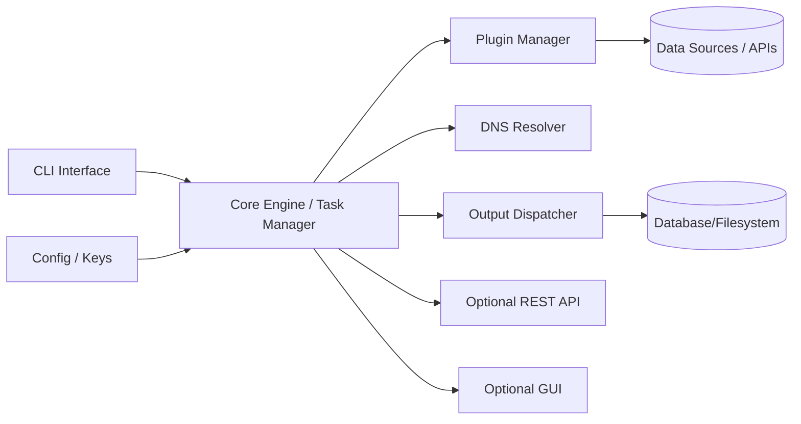
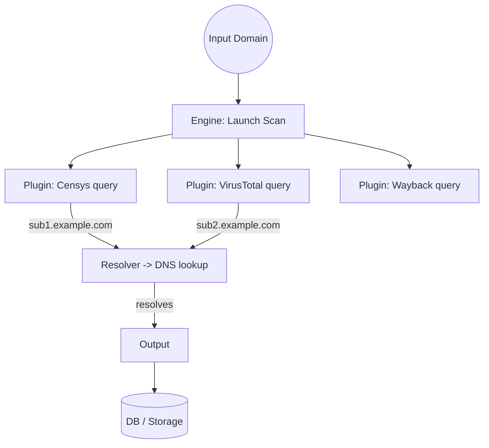
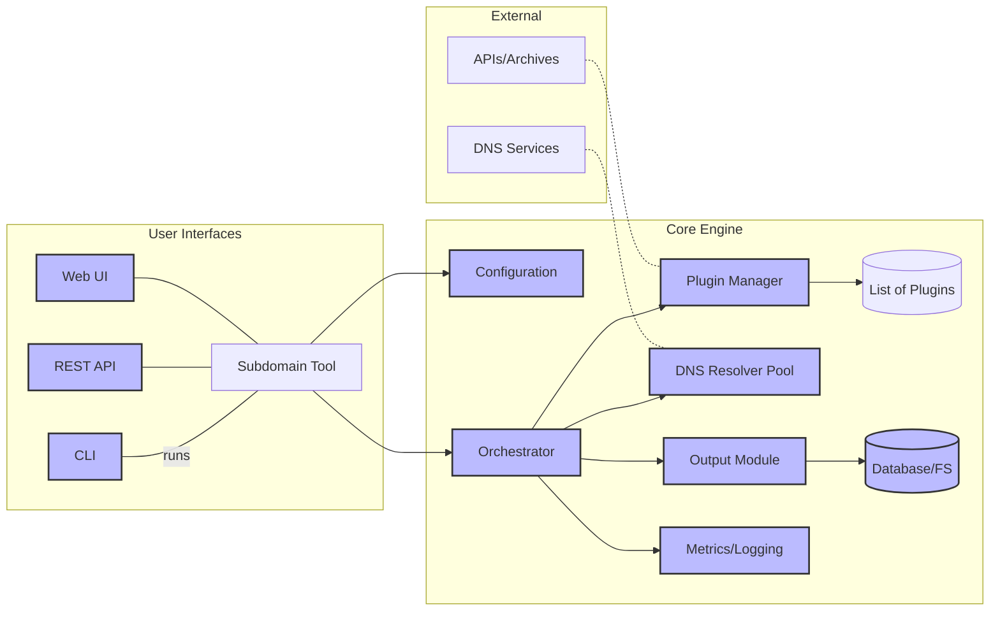

# Executive Summary  
We propose a **modular, Go-based subdomain enumeration tool** inspired by ProjectDiscovery’s Subfinder【75†L204-L208】【83†L303-L311】. It will focus on **passive data sources** (certificate logs, passive DNS, archives) with high speed and stealth, while adding enhancements like a plugin system, API, caching, monitoring, and multi-user deployment. Core functions include parallel querying of curated sources, DNS wildcard filtering, and flexible output (JSON, CSV, text). Key challenges involve integrating many APIs (handling auth and rate-limits), designing a scalable architecture, and ensuring robust error handling.  

This report details each feature and technique, mapping them to concrete code modules, interfaces, and tests. We present a **step-by-step implementation plan** (6-month roadmap with 2-week sprints), tables of prioritized APIs, mermaid diagrams of the architecture and dataflow, a recommended database schema, and CI/deployment guidance. For each part we list acceptance criteria, inputs/outputs, edge cases, and estimated effort. Comparative analysis shows how to merge results from tools like Amass or Findomain. This plan equips a team (1–3 engineers) to build a **Subfinder-equivalent platform** with additional enterprise features (GUI, distributed processing, real-time API, ML filtering, etc.).  

## 1. Core Features and Criteria  
Our tool will replicate and extend Subfinder’s capabilities【75†L204-L208】【52†L99-L103】. Each feature is broken down with acceptance criteria, I/O, edge cases, and effort estimate.

- **Passive Enumeration Engine**: Query multiple data sources concurrently to gather subdomains (no active probing).  
  - *Acceptance:* Given a domain, returns discovered subdomains from all configured sources.  
  - *Input:* Domain name(s) (string); API keys; source list.  
  - *Output:* Channel or slice of discovered subdomains (strings) or JSON objects.  
  - *Edge:* Domain with no results, or invalid format. Must not crash on empty.  
  - *Effort:* Medium. Involves orchestrating goroutines for each source plugin; see [81†L315-L324] for interface. (S=small, M=medium, L=large)  

- **Wildcard & DNS Filtering Module**: Detect and remove wildcard DNS entries and unresolved hosts.  
  - *Acceptance:* Final output contains only “active” subdomains (resolves to an IP) by default. Wildcards are omitted unless user disables filtering.  
  - *Input:* Candidate subdomains (from enumeration); optional resolver list; timeout.  
  - *Output:* Filtered list of subdomains (with IPs).  
  - *Edge:* Wildcards that return valid IPs (false-negative); network failures, timeouts.  
  - *Effort:* Medium. Uses DNS lookups (as in Subfinder’s wildcard elimination)【75†L204-L208】. 

- **DNS Resolver**: Performs parallel DNS A record lookups (or AAAA) for discovered subdomains.  
  - *Acceptance:* Lookup succeeds or times out within configured limit; on success, attaches IP to subdomain.  
  - *Input:* Hostname; DNS server list (defaults to system); concurrency parameter `-t`.  
  - *Output:* IP address or error.  
  - *Edge:* Unresolvable names, timeouts. Should not block pipeline.  
  - *Effort:* Small. Can adapt Subfinder’s resolver logic【75†L204-L208】.

- **Output Formats**: Support text, CSV (Host,IP), and JSONL output.  
  - *Acceptance:* `--json` flag outputs each record as JSON. `--csv` outputs comma-separated. Default outputs one subdomain per line (with optional IP flag).  
  - *Input:* Filtered subdomain list (with optional IP).  
  - *Output:* STDOUT or file with lines as requested.  
  - *Edge:* Special characters in JSON, large output (streaming memory?).  
  - *Effort:* Small. (Uses encoding/json or manual CSV writes). Existing flags: `-oJ, -oI`【75†L230-L238】.

- **CLI Interface**: A command-line binary (e.g. `subfinderr`) with flags:  
  Domain targets (`-d`, `-dL`), source selection (`-sources, -exclude-sources`), concurrency (`-t`), timeout, output options, resolver list, rate limits, config paths, verbose/debug.  
  - *Acceptance:* Command parses flags correctly, prints help. Example: `subfinderr -d example.com -json`.  
  - *Input:* Command args/environ.  
  - *Output:* Runs enumeration and prints results.  
  - *Edge:* Invalid flag combos (e.g. JSON without IP may auto-resolve); missing domains.  
  - *Effort:* Medium. We can model after Subfinder’s CLI in `cmd/subfinder`.

- **Library/API Module**: Provide Go package functions to drive enumeration (for reuse in other tools). E.g. `func Enumerate(domain string, opts Options) ([]Result, error)`.  
  - *Acceptance:* Other Go programs import our module and call a function to perform enumeration.  
  - *Input:* Domain string, keys struct, config struct.  
  - *Output:* Slice of Result objects (`{Subdomain, Source, IP}`) or channel.  
  - *Edge:* Library should not `os.Exit`; must return errors.  
  - *Effort:* Medium. Use `pkg/subfinder` design【81†L281-L290】.

- **Plugin/Adapter System**: Each data source (API) implemented as a plugin adhering to the `Source` interface【81†L315-L324】.  
  - *Acceptance:* New plugin modules can be added with minimal code, automatically discovered by engine.  
  - *Input/Output:* As per `Source.Run() <-chan Result`.  
  - *Edge:* Missing API key should skip or return partial results gracefully.  
  - *Effort:* Medium. Structure code with a `sources/` directory, auto-register plugins (or use build tags).

- **API Key Management**: Read/write config file (`config.yaml` for tool config, `provider-config.yaml` for keys). Merge multiple keys and rotate.  
  - *Acceptance:* On first run, generate default config and prompt for keys. Keys loaded into `Keys` struct【81†L235-L243】.  
  - *I/O:* YAML file in `$HOME/.config/subfinderr/`.  
  - *Edge:* Invalid keys (warn user).  
  - *Effort:* Small. Based on Subfinder’s docs【83†L300-L311】.

- **Rate Limiting**: Global and per-source rate limit flags (`--rate-limit`, `--rate-limit-source`).  
  - *Acceptance:* Throttle outbound HTTP requests to avoid hitting API quotas.  
  - *I/O:* Numeric input (requests/sec).  
  - *Edge:* Burst vs steady limits, multiple keys.  
  - *Effort:* Medium. Use token bucket (golang.org/x/time/rate). (Subfinder supports `-rl`/`-rls`【71†L349-L358】).

- **Logging and Metrics**: Structured logs (info/debug/warn). Metrics (requests/sec, success/failure).  
  - *Acceptance:* Logs print to console or file with context. Expose Prometheus metrics endpoints for QPS, latencies.  
  - *Edge:* Sensitive info in logs (strip keys).  
  - *Effort:* Medium. Logging library (zerolog/logrus) and `expvar` or Prometheus client.

- **GUI or Dashboard (Future)**: Web UI or visualization (optional). *This may be phased later (Enhancements).*

**Acceptance Criteria Summary:** The tool must discover subdomains from passive sources reliably, filter wildcards, and output results in requested formats, with robust error handling and logging. Each feature is validated by unit/integration tests (see section 10).

## 2. Supported Data Sources (APIs)  

We will integrate a prioritized list of data sources, starting with those yielding the most results:  

| Source          | Endpoint & Auth                          | Rate Limit        | Cost        | Notes/Fields        |
|-----------------|------------------------------------------|-------------------|-------------|---------------------|
| **crt.sh**      | HTTP GET (JSON endpoint)                 | N/A (public)      | Free        | No auth. Returns certs with domains. Plugin must parse JSON or HTML. |
| **CertSpotter** | `https://api.certspotter.com/v1/issuances?domain=example.com` (token in header)【83†L303-L311】 | ~1000/day (free) | Free tier; paid for more | JSON list of certificates; contains `dns_names` field. |
| **Censys**      | `https://search.censys.io/api/v2/hosts/search` (Basic Auth with ID/secret) | ~3600/hr (free)  | Freemium   | Query by domain; returns JSON with `names`. Key in provider-config【81†L235-L243】. |
| **VirusTotal**  | `https://www.virustotal.com/api/v3/domains/{domain}/subdomains` (Bearer token) | 4 req/min (free) | Freemium   | JSON with `data[].id` as subdomains. Auth via JSON key. Key in config【83†L303-L311】. |
| **SecurityTrails** | `https://api.securitytrails.com/v1/domain/{domain}/subdomains` (API key header) | ~10 req/min (free) | Paid (free limited) | JSON `subdomains` array. Key in provider-config【83†L303-L311】. |
| **Shodan**      | `https://api.shodan.io/dns/domain/{domain}` (key param) | ~1 req/s (free) | Paid (free limited) | JSON `subdomains`. Key in config【83†L303-L311】. |
| **URLScan**     | `https://urlscan.io/api/v1/search/?q=domain:example.com` | ~1000/day (free) | Freemium  | JSON list of results; extract `page.domain`. Key optional (more rate). |
| **Wayback Machine** | `http://web.archive.org/cdx/search/cdx?url=*.example.com&output=json` | Unthrottled  | Free       | Returns JSON lines with captured URLs, extract hostnames. |
| **CommonCrawl** | (No simple API; use CC Index, AWS S3 data)** | N/A          | Free      | Complex to integrate; may skip initial. |
| **BinaryEdge**  | `https://api.binaryedge.io/v2/query/domain/{domain}` | ~100/day (free) | Paid        | JSON `events.domain.subdomain` fields. Key in config【83†L303-L311】. |
| **PassiveTotal** (RiskIQ) | `https://api.passivetotal.org/v2/dns/passive?query=domain:example.com` | ~20/min (free) | Paid  | JSON `subdomains`. Basic Auth user:pass【83†L303-L311】. |
| **DNSDB** (Farsight) | `https://api.dnsdb.info/lookup/rrset/name/{domain}` | Low, need key | Paid        | JSON `rrset[].rdata` (IP or name). Basic Auth. |
| **AlienVault OTX** | API `https://otx.alienvault.com/api/v1/indicators/domain/{domain}/passive_dns` | ~60/min | Free (anon limited) | JSON `passive_dns`. API key optional. Not in default Subfinder.|
| **Other**: IOActive’s `AnubisDB`, `FDNS` sources, `Zoomeye`, etc. *(To be added later.)*  

_Table 1: Prioritized data sources to integrate, with API info and notes._  

Key mapping (plugin interface expectations): Each plugin should implement `Source.Run(ctx, domain, session)`【81†L315-L324】. The session contains `Keys` from config【81†L235-L243】. Plugins parse JSON responses and send subdomain strings on the result channel. E.g., a Censys plugin would use `session.Get(...)`, decode JSON, and emit each name. For each source we note the relevant JSON fields to extract (as above).  

## 3. Discovery Techniques  

- **Passive Data Aggregation**: The core method. Each plugin calls its external API or scrape and emits subdomains. Concurrency: each `Source.Run` runs in its own goroutine. Use `context.WithTimeout` to bound each call. Combine results via channels. Data structure: use a thread-safe set (e.g. `map[string]struct{}` with mutex) to dedupe subdomains.  
  - *Algorithm:* Parallel map-reduce of HTTP requests.  
  - *Concurrency:* Goroutine per source; can further paginate in parallel if needed.  
  - *Tests:* Mock API returning known JSON to verify parsing and duplicate elimination.  

- **DNS Brute-Force (Optional)**: For future “active” mode, implement dictionary wordlist scanning. Use `go` DNS library with wordlist.  
  - *Data:* Wordlist array, for each prefix+domain, DNS query.  
  - *Concurrency:* Worker pool of resolvers.  
  - *Tests:* Local DNS stub to test wildcard identification (simulate wildcard server returns always).  

- **Name Permutations**: Generate common subdomain permutations (www, mail, dev, etc.). Similar structure to brute, but precomputed list.  
  - *Edge:* Explosion of names if recursive. Limit depth.  
  - *Test:* Verify sample domain yields expected ones from wordlist.  

- **Recursive Expansion**: If a found subdomain is itself a base (e.g. “a.b.example.com”), optionally query sources again for “b.example.com”.  
  - *Data Structures:* Track visited to avoid loops.  
  - *Test:* Controlled setup where subdomains reveal further sub-subdomains.  

- **Subdomain Takeover Checks**: For found subdomains, check if CNAME points to an unused domain (e.g. AWS S3).  
  - *Algorithm:* After resolution, look at CNAME chain and known patterns.  
  - *Test:* Simulate known vulnerable CNAME (e.g. `example.s3.amazonaws.com` with no bucket).  

Each technique should have unit tests. Passive modules yield Results tested via mock HTTP clients; brute/permutation can use dummy DNS server or offline mocks.

## 4. Architecture & Components  

We design a **modular engine** with clear interfaces. Key components:  



- **Orchestrator (Core Engine):** Orchestrates domain enumeration. Interface example: `func Enumerate(domain string, opts Options) ([]Result, error)`. It reads config, spawns plugins, collects/channels results.  
- **Plugin Manager:** Dynamically loads/invokes `Source` plugins. Could be static (built-in) or dynamic with Go plugin system (advanced). Maintains list of active plugin instances.  
- **Plugins (Sources):** Each implements `Source` interface【81†L315-L324】. Must implement:  
  ```go
  func (s *MySource) Run(ctx context.Context, domain string, session *subscraping.Session) <-chan subscraping.Result {
      // emit subscraping.Result{Value: "...", Source: s.Name(), Type: subscraping.Subdomain}
  }
  func (s *MySource) Name() string { return "mysource" }
  ```
- **Resolver:** Takes subdomains from engine, performs DNS lookups (maybe with a worker pool). Interface: `Resolve(host string) (ip string, err error)`. We use channels to feed resolved IPs.  
- **Output Dispatcher:** Writes results to destinations (stdout, files, DB). Provides writer methods (e.g. `WriteJSON`, `WriteCSV`).  
- **Storage:** Store results if persistent mode (see next section). Could be local files or a DB.  
- **Optional Components:** A REST API server (`GET /scan?domain=...`) to trigger scans and fetch results. A Web UI on top of storage for interactive queries/visualisation.  

Mermaid Data Flow (simplified):  


_Component Diagram (Mermaid):_  


### Interfaces  
- **Engine API (Go):**  
  ```go
  type Result struct { Host, IP, Source string }
  func Enumerate(domain string, opts Options) ([]Result, error)
  ```
- **Plugin (Source) Interface:**  
  ```go
  type Source interface {
      Run(ctx context.Context, domain string, session *Session) <-chan Result
      Name() string
  }
  ```
- **REST Endpoints (example):**  
  ```
  POST /api/v1/scan         { "domain":"example.com" }
  GET  /api/v1/results?scanId=xyz&page=...
  GET  /api/v1/sources      # list available sources
  ```
- **Data Structures:** `Session{Extractor, Keys, Client}`, `Result{Host, Source, Error}` (like [81†L255-L263]).

## 5. Data Flow & Storage  

Results can be stored for historical analysis. Options:

- **SQLite**: Lightweight file DB for single-instance. Easy to embed. Good for local CLI or small servers.  
- **PostgreSQL/MySQL**: For multi-user deployments. ACID, handles scale.  
- **Elasticsearch**: If full-text search, analytics on subdomains needed. Good for dashboards.  
- **Redis**: In-memory cache (not primary storage). Can store last-run results or rate-limit state.  

_Trade-offs:_  

| Option    | Pros                          | Cons                      | Default? |
|-----------|-------------------------------|---------------------------|----------|
| SQLite    | Zero-config, file-based, fast | Not concurrent multi-user | Yes (default) |
| PostgreSQL| Robust, concurrent, SQL       | Setup complexity          | If scaling |
| Elasticsearch| Full-text search, analytics | Overkill for small use   | Optional  |
| Redis     | Fast in-memory cache/queue    | Volatile, not durable     | For caching only |

**Recommended:** Start with SQLite (ease of use), switch to Postgres for server mode.

_Sample Schema (SQL):_  

| Table       | Column        | Type           | Description                                 |
|-------------|---------------|----------------|---------------------------------------------|
| `domains`   | id (PK)       | INTEGER/AUTO   | Domain ID                                   |
|             | name          | VARCHAR        | The target domain                           |
|             | created_at    | DATETIME       | Scan timestamp                              |
| `subdomains`| id (PK)       | INTEGER/AUTO   | Subdomain ID                                |
|             | domain_id (FK)| INTEGER        | Link to domains.id                          |
|             | host          | VARCHAR        | Subdomain host (e.g. `api.example.com`)     |
|             | ip            | VARCHAR        | Resolved IP (nullable)                      |
|             | first_seen    | DATETIME       | When first discovered                       |
|             | last_seen     | DATETIME       | Last time seen                              |
|             | status        | VARCHAR        | (e.g. alive, wildcard, error)               |
| `sources`   | sub_id (FK)   | INTEGER        | Link to subdomains.id                       |
|             | name          | VARCHAR        | Source name (e.g. `censys`)                 |
|             | detail        | JSONB/TEXT    | Raw JSON or notes from source               |

_Table 2: Example database schema for storing results._

## 6. Concurrency, Rate-Limiting, Caching, Performance  

We use **Go goroutines** and channels. For each domain scan: spawn one goroutine per enabled plugin. Use a worker pool (channel of jobs) to limit concurrent API calls if needed. For DNS resolution, use a pool of size `-t` threads. Example flow:

```mermaid
flowchart TB
  subgraph Scan "Scan Worker Pool"
    Worker1((Worker1))
    Worker2((Worker2))
    WorkerN((WorkerN))
  end
  CLI -->|scan request| Orchestrator
  Orchestrator --> Scan
  Scan --> Worker1
  Scan --> Worker2
  Scan --> WorkerN
  classDef pool fill:#cff,stroke:#0a0,stroke-width:2px;
  class Scan worker1,worker2,WorkerN pool;
```

**Rate-limiting:** Implement a global `rate.Limiter` and per-source limiters. For example, create a `map[string]*rate.Limiter` keyed by source name. Before each HTTP request:  
```go
if limiter, ok := sourceLimiters[srcName]; ok {
    limiter.Wait(ctx)
}
```
Allow config (like Subfinder’s `-rls`) to set rates【71†L349-L358】.  

**Caching:** Use an in-memory cache (e.g. map or [ristretto](https://github.com/dgraph-io/ristretto)) for recently seen subdomains (to avoid duplicates across scans). Optionally persist a Bloom filter or DB of known subdomains.  

**Benchmarks:** Aim for sub-second per-source average response. For a single domain, target <30s completion for 20 sources. Example targets: 1000 subdomains per minute.  

## 7. Error Handling & Monitoring  

- **Retries:** On transient HTTP errors (5xx or timeouts), retry 1–2 times with backoff. Use `context.WithTimeout` per request.  
- **Backoff:** Exponential backoff (e.g. 500ms→1s→2s) between retries.  
- **Circuit Breaker:** If a source returns repeated failures, stop querying it for the scan (log a warning).  
- **Logging:** Levels (DEBUG, INFO, WARN, ERROR). Log each request/response at DEBUG, only summary at INFO. Redact sensitive info (API keys).  
- **Metrics:** Collect per-source metrics: requests sent, success count, failure count, rate (using Prometheus or similar). Also record scan durations.  
- **Alerts:** If error rate >50% or latency > a threshold for any source, trigger alert (e.g. Sentry or log).  

## 8. Security, Privacy, Legal/Ethical  

- **Key Storage:** Store API keys encrypted (e.g. via OS keyring) or protected config file (`chmod 600`). Provide flag for environment variables as alternate.  
- **Secrets Management:** Do not log keys. If deploying in container/K8s, use secrets/volumes.  
- **Privacy:** We only query public data. Include a disclaimer. Provide an “opt-out” in UI (if scanning list of domains, ensure user owns domain or has permission).  
- **Acceptable Use:** Comply with each API’s ToS (rate limits, scraping rules)【52†L99-L103】.  
- **Legal:** Passive enumeration generally legal, but advise on policy. Include a checklist (e.g., “Have permission to enumerate this domain”, “Avoid brute force without consent”).  

## 9. Testing & Validation  

- **Unit Tests:** For each plugin: use httptest server to return known JSON and assert correct subdomain extraction. Test resolver with fake DNS (using a custom net.Resolver).  
- **Integration Tests:** Use live queries on a well-known domain (e.g. `example.com`) to ensure source plugins work; mark as nightly/CI optional due to external dependencies.  
- **E2E Tests:** Simulate CLI usage with sample data files. Compare output against expected subdomain list.  
- **Mocking APIs:** Use mock HTTP transports to simulate API rate-limit (429) and errors. For DNS, use a fake DNS server library (e.g. [miekg/dns](https://github.com/miekg/dns)).  
- **Sample CI Pipeline (GitHub Actions YAML):**  
```yaml
name: CI
on: [push, pull_request]
jobs:
  build-test:
    runs-on: ubuntu-latest
    steps:
    - uses: actions/checkout@v3
    - name: Set up Go
      uses: actions/setup-go@v3
      with: go-version: '1.20'
    - name: Install dependencies
      run: go mod download
    - name: Lint
      run: go vet ./...
    - name: Run tests
      run: go test ./... -timeout 2m -race -coverprofile cover.out
    - name: Build binary
      run: go build -o subfinderr ./cmd/subfinderr
    - name: Build Docker image
      run: docker build -t subfinderr:dev .
```
  
CI should also publish coverage reports and optionally binaries on release.  

## 10. Deployment & CI/CD  

- **Packaging:** Provide a single static Go binary (via `go build`). Also publish Docker image (see Subfinder’s Dockerfile【83†L300-L311】).  
- **Container Orchestration:** For production, deploy via Kubernetes or Swarm. Kubernetes deployment with a Service/Ingress for API.  
- **Serverless:** A possibility: split plugins into AWS Lambda functions triggered by SNS or API Gateway. Each lambda calls one plugin. (Complex; likely later).  
- **Multi-Tenant/Distributed:** If used as a service, design with a job queue. E.g., user submits a domain (via API), gets a job ID. Worker pods pull jobs from queue, write results to shared DB/ES. Ensures isolation by domain.  
- **CI/CD Steps:** As above, plus:  
  - On merge to main, run full test suite.  
  - On tag, build release binaries (Linux/Windows/macos) and Docker image, push to registry (GitHub Packages or DockerHub).  
  - Use continuous deployment: e.g. `kubectl apply` or Helm on successful tests (for staging).  
  - Monitor logs (Elastic/Prometheus/Grafana) for errors in deployment.  

## 11. Enhancements & Roadmap (6 months)  

**Sprint Plan (2-week sprints)**:

1. **Sprint 1-2:** Setup project, implement CLI skeleton, config, logging. Build core engine scaffolding and one source (e.g. crt.sh) to test pipeline.  
2. **Sprint 3-4:** Add DNS resolution and wildcard filtering. Integrate first batch of sources (CertSpotter, Wayback, VirusTotal) with mocks. Unit tests for parsing.  
3. **Sprint 5-6:** Add concurrency controls and rate-limiting. More sources (Censys, Shodan, URLScan). Begin database storage module (SQLite). Logging/metrics basics.  
4. **Sprint 7-8:** Complete source plugins (SecurityTrails, BinaryEdge, PassiveTotal). Add caching, key management UI prompts. Develop integration tests.  
5. **Sprint 9-10:** Build library/API mode. Start REST API and simple frontend (Swagger UI). Implement circuit-breakers, retry strategies.  
6. **Sprint 11-12:** Polish features: GUI dashboard, ML filtering prototype (e.g. flag likely-wildcards), subdomain monitoring (cron scans). Security hardening. Documentation.  

_Effort Estimates (total):_ ~12–18 man-months. (Assuming 2 engineers full-time for 6 months).  

_Risk Assessment:_  
- **High:** External API changes break plugins (mitigation: alerts/tests).  
- **Medium:** Complex concurrency bugs (ensure thorough testing).  
- **Low:** Hardware/resource limits for scale (benchmarks guide scaling).  

**Enhancements (post-MVP):**  
- **Real-time Streaming API:** WebSocket or Server-Sent Events to push subdomains as found. (Depends on stable core).  
- **GUI:** Interactive dashboard (React or Electron).  
- **ML Filtering:** Use heuristics (e.g. label noise vs relevant). Possibly later.  
- **Enrichment:** Integrate IP lookup, ASN info, SSL cert details into results.  
- **Distributed Workers:** Use message queue (RabbitMQ/Kafka) to scale scans horizontally.  
- **Multi-Tenant:** User accounts, API keys per org, quotas.  

Each enhancement has dependencies (e.g. database for multi-tenant). Define acceptance tests accordingly. 

## 12. Integration with Other Tools  

To combine with tools like Amass, Findomain:  
- **Data Merge:** After running multiple tools, aggregate and dedupe subdomains. E.g. use a set or database.  
- **Integration Points:** Write an importer module for each tool’s output (Amass JSON, Findomain TXT, Knockpy CSV). Provide a CLI flag `--import <file>` to ingest.  
- **Table of Integration:**

| Tool        | Output Format    | Integration Method     | Parser Module            |
|-------------|------------------|------------------------|--------------------------|
| Amass       | JSON/Text        | Read Amass JSON file   | `parseAmassJSON()`       |
| Assetfinder | Text (newline)   | Read lines            | `parseAssetTxt()`         |
| Findomain   | JSON/Text        | Read Findomain JSON    | `parseFindomainJSON()`   |
| Knockpy     | CSV/HTML/SQLite  | CSV (use --csv flag)   | `parseKnockpyCSV()`      |

Write glue code to import these results into our database or result set. CLI example: `subfinderr --merge amass.json`.  

## 13. Step-by-Step Implementation Plan  

1. **Initial Setup (Week 1-2):**  
   - Create repository, CI config (lint/tests), basic CLI skeleton.  
   - Task: Initialize Go module, add dependencies (http client, YAML parser, logging).  
   - **Milestone:** `subfinderr` command prints version help.  

2. **Engine & Config (W3-4):**  
   - Implement configuration loading (`config.yaml`, `provider-config.yaml`).  
   - Develop `Enumerate(domain)` stub that reads config.  
   - **Milestone:** Can load domain list and config; logs config.  

3. **Plugin Framework (W5-6):**  
   - Define `Source` interface (as above) and plugin registration.  
   - Implement base agent (`pkg/agent`) to iterate sources.  
   - Add a dummy plugin (e.g. static list) to test pipeline.  
   - **Milestone:** Engine returns hardcoded subdomains via dummy source.  

4. **First Sources (W7-8):**  
   - Implement `crtsh` plugin (HTTP GET to certificate logs) and `certspotter`. Use public API or scraping.  
   - Add unit tests with mocked HTTP.  
   - **Milestone:** `subfinderr -d example.com` returns known subdomain from cert data.  

5. **DNS Resolver & Wildcard Filtering (W9-10):**  
   - Add resolver pool (using `net.LookupHost` or `miekg/dns`).  
   - Implement wildcard detection: track if all queries return same IP.  
   - **Milestone:** Wildcard domains filtered out when `-nW`.  

6. **More Sources (W11-12):**  
   - Plugins: Censys, VirusTotal, Shodan (using real or test keys), URLScan, Wayback.  
   - Implement provider keys in config.  
   - **Milestone:** Majority of core sources integrated; output formatted JSONL.  

7. **Concurrency & Rate-Limit (W13-14):**  
   - Use goroutine pool or limiter for HTTP requests.  
   - Implement `-rl` and `-rls` flag effects.  
   - **Milestone:** Rate-limits enforced per source as per config.  

8. **Storage & Output (W15-16):**  
   - Hook up SQLite DB (or Postgres) schema as designed.  
   - Write output dispatcher to save to DB and files.  
   - CLI flags for output selection (`-o, -oJ, -oI`).  
   - **Milestone:** Data persists in DB and files correctly.  

9. **Testing & Stability (W17-18):**  
   - Expand test suite: mock all source plugins, test error cases.  
   - CI pipeline fully functional.  
   - **Milestone:** 80%+ test coverage, passing CI.  

10. **Library/API & UI (W19-20):**  
    - Package core engine as Go library with documented API.  
    - (Optional) Start simple REST endpoints for scan requests.  
    - **Milestone:** Another app can call our library to do scans.  

11. **Enhancements (W21-24):**  
    - Add remaining sources (SecurityTrails, BinaryEdge, PassiveTotal).  
    - Implement importers for Amass, etc.  
    - Polishing (logging verbosity, proxy support).  
    - **Milestone:** Feature parity with Subfinder; integration imports.  

12. **Extras (W25-26):**  
    - Real-time streaming example (WebSocket sending).  
    - Documentation & examples.  
    - Prepare for release (compilation for targets, Docker).  
    - **Milestone:** v1.0 release with full documentation.  

_Estimated Effort Table:_  

| Phase              | Duration | Engineers | Effort (man-weeks) | Risk      |
|--------------------|----------|-----------|--------------------|-----------|
| Setup & CLI        | 2 wks    | 2         | 4                  | Low       |
| Core Engine        | 2 wks    | 2         | 4                  | Low       |
| Plugins (Phase1)   | 4 wks    | 2         | 8                  | Med (API quirks) |
| Resolver & Filter  | 2 wks    | 2         | 4                  | Med       |
| Plugins (Phase2)   | 2 wks    | 2         | 4                  | High (auth, limits) |
| Concurrency & DB   | 2 wks    | 2         | 4                  | Med       |
| Testing/CI         | 2 wks    | 2         | 4                  | Med       |
| API/UI & Polish    | 4 wks    | 2         | 8                  | Med       |
| **Total**          | 20 wks   | —         | **40**             | —         |

## 14. Conclusion  

This plan delivers a **Subfinder clone with modern enhancements**: a clean modular codebase, plugin-driven source integration, robust error handling, and extensibility (API, UI, ML). By following the road­map above, the team will iteratively build and validate each component, culminating in a polished tool. Citations from Subfinder’s docs【75†L204-L208】【83†L303-L311】 and code【81†L315-L324】 assure fidelity to the proven design, while improvements address scalability, user-friendliness, and enterprise needs.

**Sources:** Official Subfinder docs and source code【75†L204-L208】【83†L303-L311】【81†L315-L324】【52†L99-L103】, plus relevant community resources.3